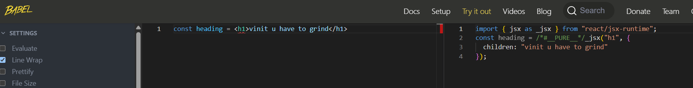

- jsx is syntax which makes it easy to write React.createElement("h1",{},"hello");

- jsx is not html inside javascript 

- jsx is HTML or XML more  like syntax

- is jsx valid javascript ? not pure js ? my js engine donot understand jsx(<>h1,div) -> NO -> it understands ecma-script

- how come <> h1,div angular bracket came in javascript . so if js engine donot understand this , then how come it is rendering ? -> parcel is doing it bts

- so after jsx is written it is transpilled before giving to the js engine or root.render(parent);
- transpile(converting into a code that browser understands)
- parcel has another package [Babel] for this job -babel is again a js package
- jsx code is transpiled to react.createElement() bts , this then generates react element(object) -> which is then rendered by reactDOM into the root(making a html element and adding to DOM)
- babel also transpiles es6 code for older browsers to understand

- jsx is not html (class in HTML but in jsx we use className)
- attributes in jsx is in camelCase

- jsx in single line is fine ...but for mulitple lines we need to wrap it with () for babel to know where our jsx start and end.

# `component
- header  footer card heading title input box search-bar list-of-cards
- everything in react is a component
- two types of component -> class based -> functional components
- no one uses class based components now
- fucntional component is just a simple js function (start with capital react way to understand component )
- this functional component returns the jsx
- in jsx use {} to write js expression or code in this 
- writing javascript inside of jsx is very [powerFULL]

- jsx is making our code much more readable than React.createElement()
- parcel managing babel(taking jsx code to React.createElement())
- React.createElement() -> react element(object) -> which gets render into the dom in form of html element
- that is done by ReactDOM
